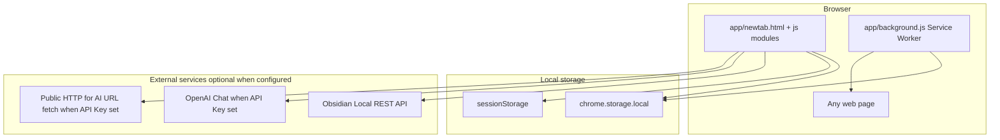
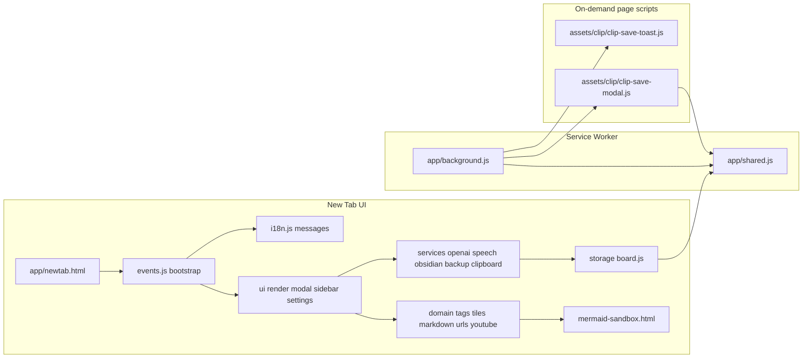
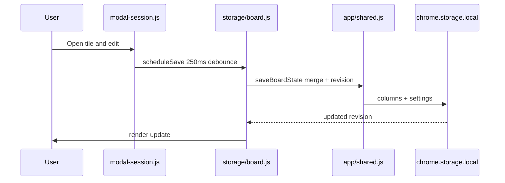
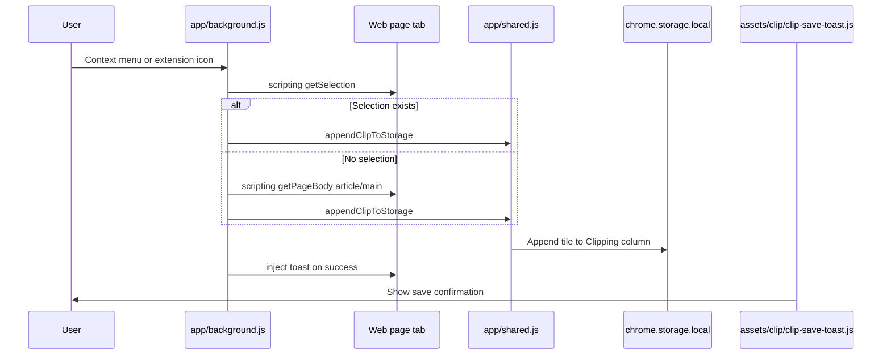
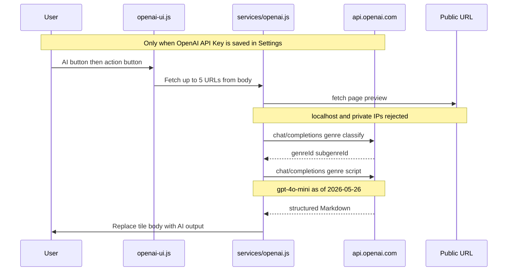

# New Tab Memo Board

[](manifest.json)
[](README.md#license)
[](manifest.json)

A Chrome extension that replaces the new tab page with a **column-style memo board**.  
Organize prompts, todos, notes, and web clips as tiles—with tagging, Markdown preview, Obsidian export, and JSON backup—all on one screen. OpenAI summaries are available **only when you enter an API Key in Settings**.

**Requirements:** Google Chrome (or another Chromium-based browser)  
**Manifest:** V3  
**Data storage:** Local `chrome.storage.local` only (no cloud sync)

---

## Table of Contents

- [Overview](#overview)
- [Tech Stack](#tech-stack)
- [Architecture](#architecture)
- [Key Flows](#key-flows)
- [Features](#features)
- [Quick Start](#quick-start)
- [Installation (Developer Mode)](#installation-developer-mode)
- [Development and Testing](#development-and-testing)
- [Directory Layout](#directory-layout)
- [External Integrations](#external-integrations)
- [Permissions and Security](#permissions-and-security)
- [Privacy](#privacy)
- [License](#license)

---

## Overview

Each time you open a new tab, a **3-column board** appears. Each column holds “tiles” (memo cards) that you can edit—column title, body text, color, and tags. Edits auto-save after about 250ms debounce and persist after you close the browser.

| Column | Default name | Example use |
| --- | --- | --- |
| 1 | Memo (メモ) | Tasks and todos |
| 2 | Memo (メモ) | General notes, prompts, ideas |
| 3 | Clipping | Web clips saved from pages |

Column names are stored in data and shown as **editable title inputs** at the top of each column (used for Clipping column detection, Obsidian export, etc.). Placeholders fall back to locale-specific defaults.

UI language supports **Japanese, English, Chinese (Simplified), Korean, Spanish, and Bengali** (Settings → Language: `auto` | `ja` | `en` | `zh` | `ko` | `es` | `bn`). With `auto`, the browser language resolves to one of these locales. Tile “Updated” labels use the same locale for date/time formatting.

---

## Tech Stack

| Layer | Technology | Notes |
| --- | --- | --- |
| Platform | Chrome Extension **Manifest V3** | `chrome_url_overrides.newtab` |
| Frontend | HTML / CSS / **Vanilla JavaScript** | No framework |
| Background | **Service Worker** (`app/background.js`) | Clip save, context menu |
| Persistence | `chrome.storage.local` | Columns, tiles, settings, revision tracking |
| Session | `sessionStorage` | Clipboard tracking (optional auto-paste) |
| Shared logic | `app/shared.js` | Loaded via `importScripts` in SW and new tab |
| External API (optional) | Obsidian Local REST API | When configured. localhost:27123 / 27124 |
| External API (optional) | OpenAI Chat Completions | **Only when API Key is set**. Two-step genre classification + structured summary. Model as of 2026-05-26: `gpt-4o-mini` (`js/01-constants.js` / `js/services/openai.js`; may change in future releases) |
| Speech input | **Web Speech API** (browser) | Real-time dictation in the tile modal (Chrome / Edge). No Whisper / OpenAI audio API |
| Markdown diagrams | **Mermaid** (bundled) via `mermaid-sandbox.html` | Rendered in an extension sandbox iframe (CSP-safe) |
| Tests | Node.js **`node:test`** | Domain and storage logic without DOM |



---

## Architecture

The extension splits into three parts: **new tab UI**, **Service Worker**, and **on-demand injected scripts**.



### Module layout

`app/newtab.html` loads `js/` modules via explicit `<script>` tags. `js/load-order.json` mirrors that order for packaging and tests. Modules communicate via global functions at runtime (no build step).

| Directory | Responsibility |
| --- | --- |
| `js/domain/` | Pure logic: tags, tiles, Markdown, URLs, YouTube, etc. |
| `js/storage/` | `loadState` / `saveState`, merge with other tabs |
| `js/services/` | OpenAI, speech input (Web Speech), Obsidian, backup, clipboard |
| `js/services/openai-prompt-defaults.js` | Bundled default AI prompt text |
| `js/services/openai-genre-taxonomy.js` | Generated genre/subgenre taxonomy (8×16) for AI classification |
| `scripts/generate-genre-taxonomy.mjs` | Source generator for `openai-genre-taxonomy.js` |
| `mermaid-sandbox.html` | Sandboxed Mermaid SVG rendering for Markdown preview |
| `js/ui/` | Rendering, modal, sidebar, settings |
| `app/shared.js` | Constants, normalization, `saveBoardState`, clip append |

**The source of truth for development is the `js/` modules** (edit modules directly; no monolith rebuild step).

---

## Key Flows

### Tile edit and auto-save



### Web clip save



### OpenAI summary (only when API Key is set)



---

## Features

### Memo board

- **3 columns** — Editable column title at the top of each column
- **Add / delete tiles** — Add slot at column bottom / trash button (`<dialog>` confirmation)
- **Title display** — First line of body (leading `#` heading stripped) in the tile header. Board preview omits the duplicate title line from the body area
- **Pin (star)** — Pin a tile to the top of its column; starred tiles sort first
- **Modal editor** — Empty tiles open in edit mode; filled tiles open in preview mode. **Enter** or click preview to switch back to edit (title focus returns to body start)
- **7 colors** — White / blue / green / yellow / pink / purple / gray
- **Auto-save** — ~250ms debounce + revision-based merge
- **Drag and drop** — Full-tile drag with drop indicator; reorder within and across columns
- **Responsive layout** — Sidebar becomes a compact top bar on narrow viewports (≤760px)

### Tags and sidebar

- Tag input (space, comma, or Japanese comma; `#` optional) with suggestions
- Sidebar tag filter (**tile list shown only when a filter is active**)
- Collapsed mini UI (logo, tag filter, settings)
- Obsidian bulk sync and settings dialog

### Markdown / YouTube

- Board shows **Markdown preview** when tile body is non-empty (modal toggles edit/preview)
- **First plain line as title** — A line without `#` is rendered as `h1` in modal preview (same as an explicit `#` heading)
- Headings, lists, **blockquotes**, **tables**, code fences, links (http / https / mailto)
- **Bullet list editing** in the modal textarea:
  - **Enter** on a `- item` line inserts `- ` on the next line; Enter on an empty `- ` line exits the list
  - **Tab** / **Shift+Tab** indents / outdents bullet lines (2 spaces per level; nested lists in preview)
- **Mermaid** diagrams in ` ```mermaid ` code blocks (rendered via sandbox iframe)
- YouTube URL thumbnails

### Web clipping

| Action | Behavior |
| --- | --- |
| Right-click “Save to Tab Memo” | Save selection to Clipping column |
| Extension icon | Selection → save immediately / no selection → extract body → modal on failure |
| Save modal | Edit title, body, tags, then save |

- Default tag `clipping` (overridden when custom tags are set)
- `chrome://` and similar URLs are blocked. Modal and toast are injected **on demand** via `scripting`

### Speech input (modal)

- **Web Speech API only** (Chrome / Edge) — real-time dictation into the modal title or body
- Inserts a line break after ~700ms pause between utterances
- **Voice commands** (Japanese): `まる` / `丸` → `。`, `改行` → newline, `開業` (misheard `改行`) → newline except business compounds (`開業準備`, `開業中`, `開業 準備`, …); e.g. `予定開業　面談会` → `予定` + newline + `面談会`, `おわり` / `終わり` → stop after 1s silence (phrase not inserted)
- Red mic indicator at the bottom of the textarea while listening
- Mic button appears only when Web Speech is supported

### OpenAI / Obsidian / data

- **OpenAI actions** — **Only when API Key is set**. Click the AI button, then choose:
  - **Generate summary** / **Dig deeper** / **Simple list** / **Try it out**
- **Two-step pipeline** — (1) classify content into 8 genres × 16 subgenres (`openai-genre-taxonomy.js`), (2) generate structured Markdown with a genre-specific script
- Fetches up to **5 public URLs** from the tile body (localhost / private IPs rejected). Model **`gpt-4o-mini` as of 2026-05-26** (code default; may change). Preserves existing tile title; important passages may appear as verbatim blockquotes per prompt rules
- **OpenAI prompts (Settings UI)** — System and user prompts remain editable under Settings → **AI prompts (advanced)**, but **runtime execution currently uses bundled defaults only** (`OPENAI_CUSTOM_PROMPTS_FROM_SETTINGS_ENABLED = false` in `js/services/openai-prompts.js`). Defaults live in `js/services/openai-prompt-defaults.js`
- **Obsidian** — Save Markdown via Local REST API (single tile / bulk; **when configured**)
- **JSON Backup / Import** — Tokens and API Keys excluded from backup
- **Auto backup** — Once per day when a new tab opens
- **Clipboard** — Auto-paste into empty tiles is **OFF by default** (enable in Settings)

### Prompt templates (6 types)

Requirements / code review / implementation plan / incident investigation / writing cleanup / ADR (labels depend on UI locale)

---

## Quick Start

1. Open a new tab
2. Click a tile to enter a memo (filled tiles open in preview)
3. Add tags such as `todo work`
4. Use sidebar tag filter → open modal from the filtered list
5. On the web, select text → right-click **“Save to Tab Memo”** or use the extension icon
6. (Optional) Configure Obsidian, OpenAI API Key, backup, and language in Settings
7. (When OpenAI is configured) Use the **AI button** → pick an action (summary, deep dive, simple list, try it)
8. (When speech input is available) Use the **mic button** in the modal; say `改行` / `まる` / `おわり` as needed
9. In edit mode, start a bullet with `- ` and press **Enter** to continue the list; use **Tab** to nest items

---

## Installation (Developer Mode)

1. Clone the repo or extract the ZIP
2. Open `chrome://extensions` in Chrome
3. Turn on **Developer mode**
4. Click **Load unpacked**
5. Select the **`chrome_newtab_prompt_columns`** folder (the directory containing `manifest.json`)
6. Open a new tab and confirm the board appears

> Not published on the Chrome Web Store. Users need Developer mode or enterprise distribution.

---

## Development and Testing

### Run tests

Domain logic is verified in Node.js (excluding live Obsidian / OpenAI calls).

```bash
node scripts/run-tests.mjs
```

Currently **115 tests** (`tests/shared.test.mjs`, `tests/domain.test.mjs`, `tests/delete-flow.test.mjs`, `tests/speech-input.test.mjs`).

### Package for distribution

Copy runtime files into `dist/` and create a ZIP (manifest at archive root):

```bash
node scripts/package-extension.mjs
```

Use `--dry-run` to list included files without writing output.

### Optional tips (Stripe Payment Link)

Core features stay free. To show **Settings → Support development → Tip via Stripe**:

1. In [Stripe Dashboard](https://dashboard.stripe.com/), open **Payment links** → **Create**
2. Use a **one-time** link; enable **Customers choose what to pay** for voluntary tips
3. Copy the `https://buy.stripe.com/...` (or `https://donate.stripe.com/...`) URL
4. Set it in `js/01-constants.js` as `SUPPORT_STRIPE_PAYMENT_URL` (see `config/examples/support-payment.url.example`)
5. Rebuild the store ZIP: `node scripts/package-extension.mjs`

If `SUPPORT_STRIPE_PAYMENT_URL` is empty, the support section is hidden. Only `https://*.stripe.com` hosts are accepted.

For Chrome Web Store: mention optional Stripe tips in the listing description and declare third-party payments if required.

---

## Directory Layout

```
chrome_newtab_prompt_columns/
├── manifest.json
├── app/shared.js             # Shared constants, storage merge, security
├── config/examples/
│   └── support-payment.url.example
├── app/background.js         # Service Worker (clips, menu)
├── assets/clip/
│   ├── clip-save-modal.js/css  # Save modal (page injection)
│   └── clip-save-toast.js/css  # Save toast (page injection)
├── app/newtab.html           # New tab UI (HTML)
├── newtab.css                # New tab UI (styles)
├── js/
│   ├── load-order.json       # Script load order
│   ├── i18n.js / i18n.messages.js / i18n.messages.locales.js
│   ├── 00-shared-import.js … 03-templates.js
│   ├── domain/               # Tags, tiles, Markdown, URLs, YouTube
│   ├── storage/              # chrome.storage read/write
│   ├── services/             # OpenAI, speech, Obsidian, backup, clipboard
│   │   ├── openai-prompt-defaults.js  # Bundled AI prompt text
│   │   ├── openai-genre-taxonomy.js   # Generated 8×16 genre taxonomy
│   │   ├── openai-genre-taxonomy-loader.js
│   │   └── openai-prompts.js          # Prompt assembly, actions, templates
│   ├── ui/                   # render, modal, sidebar, settings
│   ├── utils/
│   └── events.js             # Event wiring and bootstrap
├── tests/
│   ├── shared.test.mjs
│   └── ...
├── scripts/
│   ├── run-tests.mjs
│   ├── package-extension.mjs      # Distribution ZIP
│   ├── generate-genre-taxonomy.mjs
│   ├── genre-section-overrides.mjs
│   └── write-i18n-locales.mjs
├── dist/                     # Generated by package-extension.mjs (gitignored)
├── icons/
└── README.md
```

---

## External Integrations

### OpenAI (optional)

**No traffic is sent to the OpenAI API unless you set an API Key** (the AI button stays hidden otherwise).

1. Create an API Key on the [OpenAI Platform](https://platform.openai.com/)
2. Open extension **Settings** → enter **OpenAI API Key** (`sk-...`) → **Save**
3. In the tile modal, click the **AI button** → choose an action (summary / deep dive / simple list / try it). URL fetch and API calls run after confirmation when URLs are present.

**Model (as of 2026-05-26):** Chat Completions API, `gpt-4o-mini` (constant `OPENAI_DEFAULT_MODEL`). This reflects the implementation at the time of writing and may change in future versions.

**Genre taxonomy:** Classification and section scripts are defined in `js/services/openai-genre-taxonomy.js` (generated from `scripts/generate-genre-taxonomy.mjs`). Regenerate after editing the script source.

**Prompts (Settings UI):** Under Settings → **AI prompts (advanced)**, System and User prompts can be edited and saved. **As of 2026-05-26, execution ignores saved custom prompts** and uses bundled defaults in `openai-prompt-defaults.js` until `OPENAI_CUSTOM_PROMPTS_FROM_SETTINGS_ENABLED` is set to `true` in `openai-prompts.js`. Placeholders when custom prompts are re-enabled:

| Target | Placeholders |
| --- | --- |
| System | `{{URL_TILE_RULE}}`, `{{SECTION_LIMIT_RULE}}`, `{{YOUTUBE_SYSTEM_RULE}}` |
| User (memo only) | `{{MEMO_BODY}}` |
| User (with URLs) | `{{MEMO_BODY}}`, `{{URL_CONTEXTS}}`, `{{YOUTUBE_EXTRA_RULES}}` |

Saving empty fields falls back to bundled defaults on the next load. Bundled text lives in `js/services/openai-prompt-defaults.js`.

The API Key is stored in `chrome.storage.local` only. JSON backup and import **exclude it / preserve the existing value**.

### Obsidian

1. Enable [Local REST API](https://github.com/coddingtonbear/obsidian-local-rest-api) in Obsidian
2. In extension **Settings** (see `?` next to the API Key field for steps):
   - Folder: e.g. `Inbox`
   - API URL: `http://127.0.0.1:27123`
   - API Key: from the plugin
3. Save from the modal or **Sync to Obsidian**

---

## Permissions and Security

| Permission | Purpose |
| --- | --- |
| `storage` | Persist tiles and settings |
| `contextMenus` | Right-click “Save to Tab Memo” |
| `activeTab` / `scripting` | Read selection; inject modal/toast on demand |
| `host_permissions` localhost:27123/27124 | Obsidian Local REST API (when configured) |
| `host_permissions` api.openai.com | OpenAI Chat Completions (**only when API Key is set**) |
| `host_permissions` http/https | URL fetch for AI summary (**only when API Key is set**; internal URLs rejected in code) |
| `sandbox.pages` | `mermaid-sandbox.html` for isolated Mermaid rendering |
| CSP `extension_pages` | `script-src 'self' 'wasm-unsafe-eval'` (Mermaid WASM in sandbox only) |

**Other safeguards**

- Obsidian endpoints limited to localhost / 127.0.0.1, ports 27123/27124
- AI URL fetch rejects localhost and private IPs
- Markdown links allow http / https / mailto only
- Mermaid runs in a dedicated sandbox page, not inline in the new tab document
- Speech input uses the microphone only while the modal mic button is active
- Delete, JSON import, etc. use confirmation dialogs or validation

---

## Privacy

- Memo data stays **in the user’s browser** (`chrome.storage.local`); nothing is sent to the extension author’s servers
- OpenAI is used **only when the user sets an API Key** (no AI button and no API calls otherwise)
- Speech input uses the **browser Web Speech API** only; audio is not sent to OpenAI for transcription
- Obsidian works **only when the user sets API Key and URL**
- Web clips write page content to local storage in the Clipping column
- Optional clipboard auto-paste tracks recent copies in `sessionStorage`
- Optional tips open **Stripe Payment Link** in a new tab only when the user clicks the support button in Settings (no background payment redirects)

---

## License

MIT License — Copyright (c) 2026 Taishi

Permission is hereby granted, free of charge, to any person obtaining a copy of this software and associated documentation files (the "Software"), to deal in the Software without restriction, including without limitation the rights to use, copy, modify, merge, publish, distribute, sublicense, and/or sell copies of the Software, and to permit persons to whom the Software is furnished to do so, subject to the following conditions:

The above copyright notice and this permission notice shall be included in all copies or substantial portions of the Software.

THE SOFTWARE IS PROVIDED "AS IS", WITHOUT WARRANTY OF ANY KIND, EXPRESS OR IMPLIED, INCLUDING BUT NOT LIMITED TO THE WARRANTIES OF MERCHANTABILITY, FITNESS FOR A PARTICULAR PURPOSE AND NONINFRINGEMENT. IN NO EVENT SHALL THE AUTHORS OR COPYRIGHT HOLDERS BE LIABLE FOR ANY CLAIM, DAMAGES OR OTHER LIABILITY, WHETHER IN AN ACTION OF CONTRACT, TORT OR OTHERWISE, ARISING FROM, OUT OF OR IN CONNECTION WITH THE SOFTWARE OR THE USE OR OTHER DEALINGS IN THE SOFTWARE.
